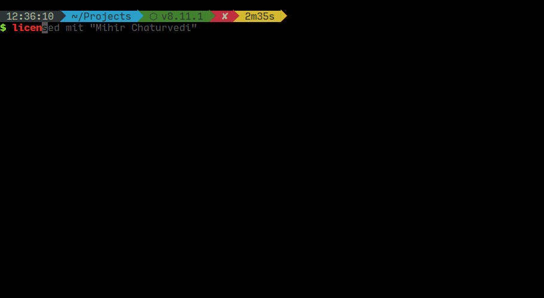

# licensed

[](https://travis-ci.org/plibither8/licensed)
[](https://www.npmjs.com/package/licensed)
[](LICENSE)
[](https://www.npmjs.com/package/licensed?activeTab=dependencies)

[](https://madewithlove.org.in/)

> ⚖ licensed is a simple, interactive command line interface to help you choose and quickly add a `LICENSE` file to your project.



## Setup

Make sure you have [NodeJS](https://nodejs.org/en/) (npm 5.2+) installed on your computer. Then, setup is as simple as:

```sh
$ npx licensed
``` 

If you've got an older version of node (npm version < 5.2) that doesn't yet have [`npx`](https://www.npmjs.com/package/npx), here's a more traditional setup:

```sh
$ npm i -g licensed
```

## Usage

After installation, navigate to your project directory ie. the directory you want your `LICENSE` file to be placed. Then:

```sh
Usage:
    $ licensed                  # Brings up an option to start a questionnaire or choose from a list of available licenses
    $ licensed <license-name>   # Brings prompt to enter your name
    $ licensed <license-name> <your-full-name> [--year | -y] <year>
    $ licensed [--list | -l]

Options:
    --year, -y <year>   Manually enter year the license is in effect
    --list, -l          List all available licenses
    --help              Show this screen
    --version           Show version

Examples:
    $ licensed mit "Mihir Chaturvedi"
    $ licensed apache
    $ licensed --year 2016
```

## Development

Run:

```sh
$ git clone https://github.com/plibither8/licensed.git
$ cd licensed
$ npm link
```

This will setup a symbolic link to the CLI. Any changes in source files will now be reflected when running the `licensed` command.

To lint your code, run

```sh
$ npm run lint
```

...and to build your files to `/lib` directory, run

```sh
$ npm run build
```

## Available licenses to choose from (currently):

* Apache 2.0
* BSD-2-Clause
* BSD-3-Clause
* GNU General Public License
* ISC
* MIT
* Mozilla Public License 2.0

## Contributions

* If you are aware of more licenses, help expand the list by suggesting or creating a pull request with the license text and name added to the `assets/licenses`, `src/licenses.js` and other respective files.
* Any other positive suggestions for this project are welcome :)

## Acknowledgements

* [Manuel Spagnolo](https://github.com/shikaan) for implementing the questionnaire.